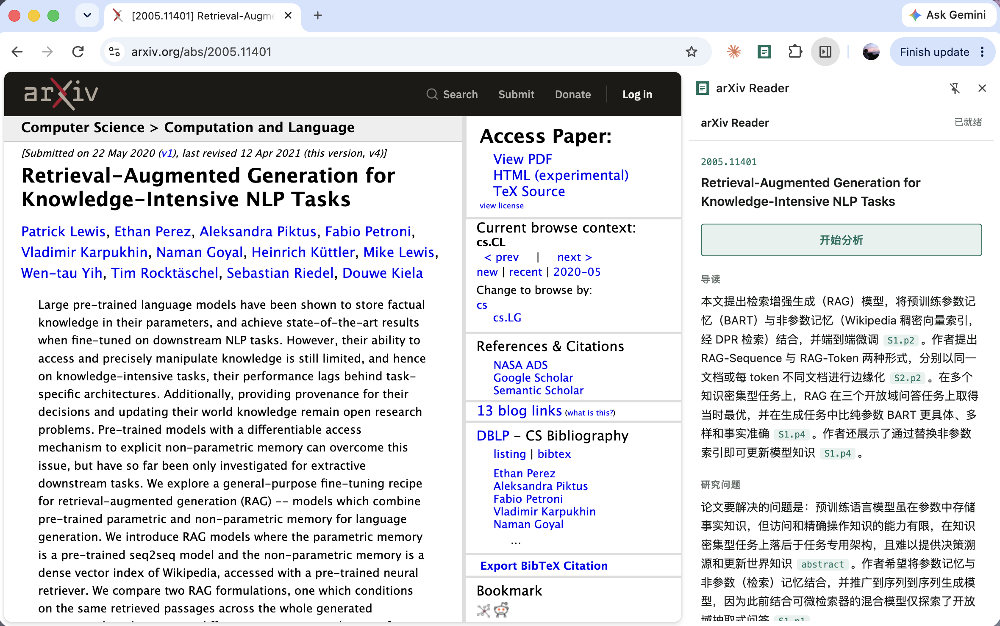

# arXiv Reader

A Chrome side-panel extension that turns an arXiv paper into a structured
reading guide — research question, method, experiments, findings,
limitations — **with every claim traceable to a specific paragraph of the
original text**. Click any paragraph ID and the page scrolls there and
highlights it.

<!-- TODO: screenshot of the side panel next to a paper page -->


Built as a study in *verifiable* LLM output: the interesting part is not the
summary, it is the evidence check that runs after it.

## What it does

- Detects the paper from any `arxiv.org/abs/`, `/html/`, or `/pdf/` URL
- Fetches arXiv's HTML rendering, parses it into sections and paragraphs,
  keeps LaTeX for formulas, drops citations and references
- Sends the whole paper (long-context, no RAG — see [DECISIONS.md](./DECISIONS.md))
  to DeepSeek with a strict schema: five fields, each with a Chinese summary
  and a list of `{id, quote}` evidence entries
- Streams the result — the summary appears within ~1 s, fields fill in as
  they complete
- **Verifies every quote** against the source paragraph and reports two
  rates: quote hit rate and inline-ID compliance
- Caches by `(paper, prompt hash, model)` so re-opening a paper is instant
  and changing the prompt never serves stale results
- Logs every request to JSONL; `stats.py` turns that into cost, latency, and
  traceability numbers

## Numbers so far

Single-paper, single-prompt-version. The evaluation set (D14) will make
these cross-paper.

| | |
|---|---|
| HTML coverage (60-paper survey, 2012–2026) | ~80 %, independent of year |
| Quote hit rate (Transformer paper) | 29 / 29 |
| Inline-ID compliance | 23 / 23 |
| Time to first token | ~1 s (was 9.3 s before streaming) |
| Tokens per paper | ~7–10 k in, ~2.3 k out |
| Cost per paper | ≈ ¥0.015 |
| Prompt v1 → v2 | evidence count 17 → 28, hit rate held at 100 % |

## How it's built

```
manifest.json       MV3 — sidePanel API, content script on arxiv.org
content.js          Extracts the arXiv ID; on /html/ pages, highlights a paragraph on request
background.js       Service worker — message relay, side panel, jump-to-paragraph
sidepanel/          UI. Reads the SSE stream and renders JSON incrementally as it arrives

backend/
  app.py            FastAPI — /analyze (one-shot) and /analyze/stream (SSE)
  fetcher.py        arXiv HTML → Paper. Fallback to abstract via API. Appendix-first truncation
  models.py         Paper / Section / Paragraph — paragraph IDs are LaTeXML's own
  serialize.py      Paper → text with [S3.p1]-style IDs the model can cite
  prompts.py        The system prompt. Every constraint maps to a DECISIONS.md entry
  llm.py            DeepSeek via the OpenAI-compatible client; JSON mode; streaming variant
  verify.py         Quote hit rate + inline-ID compliance. Only "does the citation exist",
                    not "does it support the claim" — the latter is the eval set's job
  cache.py          File cache keyed on paper + prompt hash + model + temperature
  telemetry.py      One JSONL line per request
  stats.py          Reads the log, prints the numbers above
  survey.py         The coverage survey that decided the fallback strategy
```

Design decisions, with the data that drove each one, are in
[DECISIONS.md](./DECISIONS.md). Prompt versions are in
[prompts_history.md](./backend/prompts_history.md).

## Run it locally

**Backend** (Python 3.11+):

```bash
cd backend
conda create -n arxiv python=3.11 -y && conda activate arxiv   # or any venv
pip install requests beautifulsoup4 fastapi uvicorn openai python-dotenv
cp ../.env.example ../.env         # then put your DeepSeek key in it
uvicorn app:app --reload --port 8000
```

**Extension**:

1. `chrome://extensions` → enable **Developer mode**
2. **Load unpacked** → select this repository's root folder
3. Open a paper, e.g. <https://arxiv.org/abs/1706.03762>, click the toolbar
   icon, click **开始分析**

Requires Chrome 114+ (`sidePanel` API). The extension talks to
`localhost:8000`; change `BACKEND` in `sidepanel/sidepanel.js` and
`host_permissions` in `manifest.json` to point elsewhere.

## Status

| | |
|---|---|
| Extension, fetcher, LLM, streaming, traceability, cache, telemetry | done |
| Chrome Web Store listing | pending |
| Evaluation set (cross-paper metrics, human-labelled relevance) | pending |
| Table parsing, retrieval experiment, follow-up questions | v2 — see DECISIONS.md |

## License

MIT
